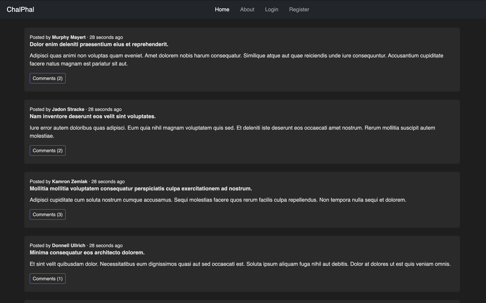
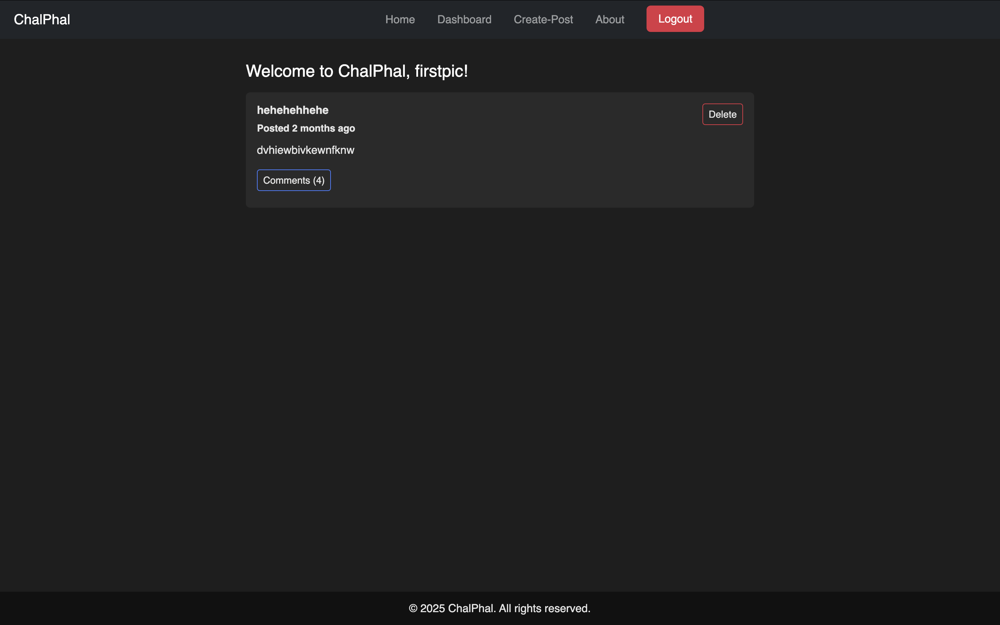
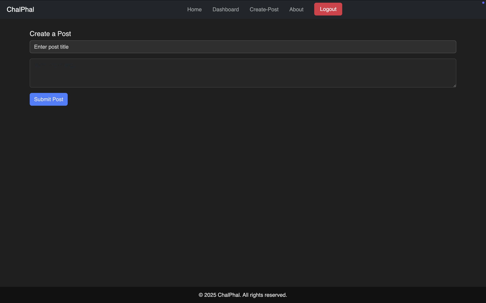
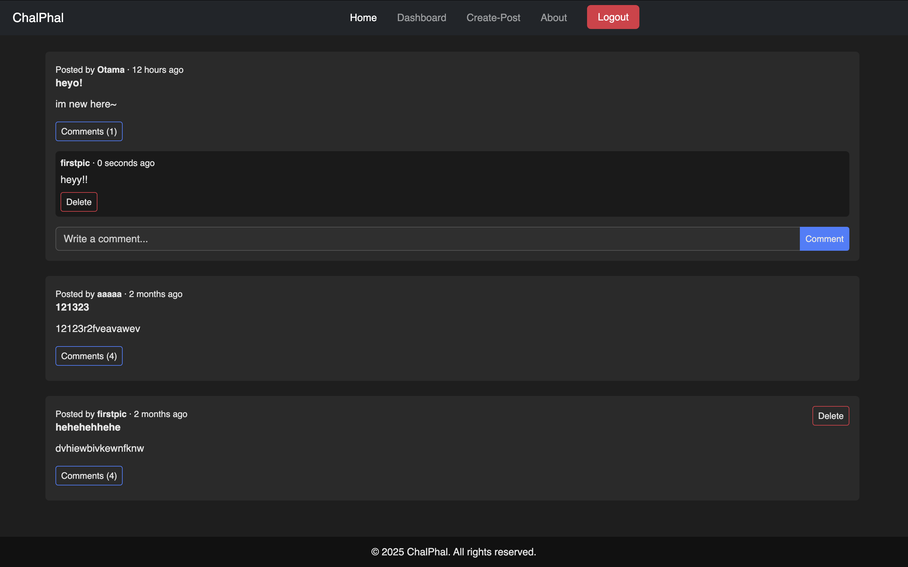
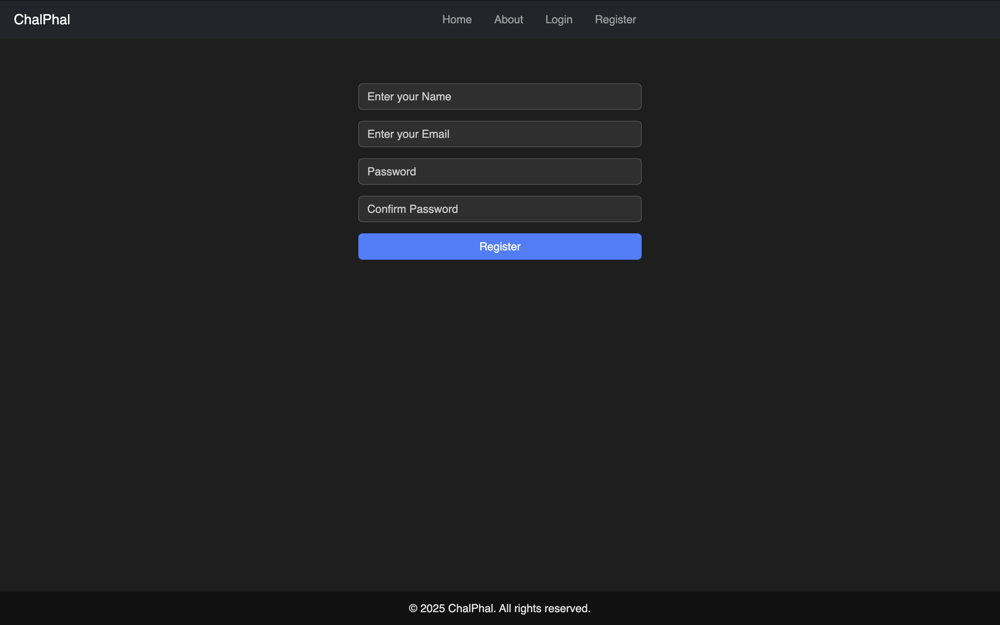

# ChalPhal – Community Posting & Discussion Platform

ChalPhal is a community-based web application built with **Laravel**, **PHP**, **Bootstrap**, and **MySQL**. It allows users to create posts, comment on discussions, and interact within a clean and responsive UI.

---

## Features

- **User Authentication:** Registration, login, and logout functionality.
- **User Roles:** Authenticated users can post and comment; guests can browse posts.
- **Post Management:** Create, view, and delete posts.
- **Comment System:** Users can comment on posts and delete their own comments.
- **Responsive UI:** Built with Bootstrap, works on both desktop and mobile.
- **Clean Design:** Dark-themed UI for a modern look.

---

## Screenshots

### Home


### Dashboard


### Create-Post


### Comments


### Login


### Register


---

## Technologies Used

- **Backend:** PHP, Laravel
- **Frontend:** HTML, CSS, JavaScript, Bootstrap
- **Database:** MySQL
- **Version Control:** Git & GitHub

---

## Installation

1. **Clone the repository**
   ```bash
   git clone https://github.com/OtamaDango/ChalPhal.git
   cd chalphal
   ```
2. **Install dependencies**
   ```bash
    composer install
    npm install
    npm run dev
   ```
3. **Set up environment**
- Update your .env file with your database credentials.
   ```bash
   cp .env.example .env
   ```  
4. **Generate application key**
    ```bash
    php artisan key:generate
    Run migrations
    php artisan migrate
    ```
8. **Start the development server**
    ```bash
    php artisan serve
    ```
## Populate Sample Data (Optional)

- After setting up the project, you can populate the database with sample data for testing:
    ```bash
    php artisan db:seed
    ```
- This drops all tables, re-runs migrations, and seeds fresh sample data.
   ```bash
   php artisan migrate:fresh --seed
    ```
## Usage

- Register a new account or login using an existing account.
- Navigate the dashboard to create, view, or delete posts.
- Comment on other users’ posts.
- Access About and Contact pages from the navbar.
- Logout when finished.

## Future Enhancements

- Add profile pictures for users.
- Allow editing posts and comments.
- Add likes/upvotes for posts and comments.
- Implement search and filter for posts.
- Mobile-first optimizations for better responsive design.


